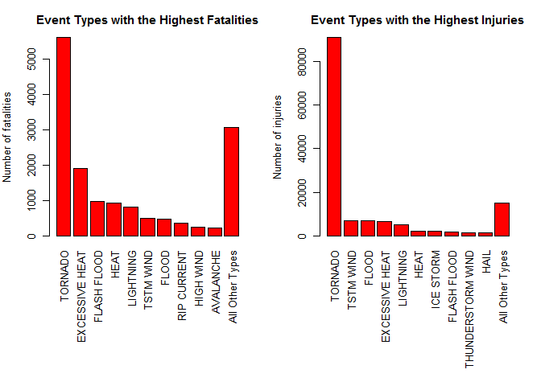
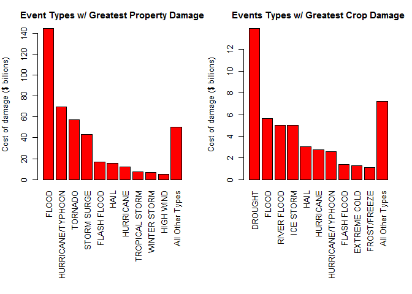
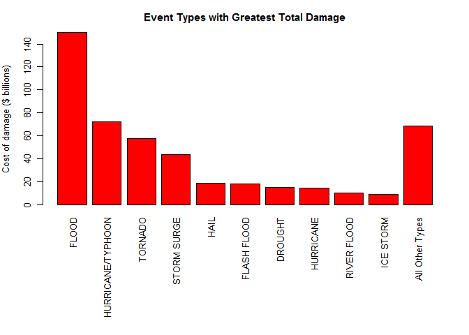

# Reproducible Research: Peer Assessment 2
# Title: Storm Event Impact Analysis

## Synopsis
Storms and other severe weather events can cause both public health and economic
problems for communities and municipalities. Severe events can cause
fatalities, injuries and property damage to crops and other property.  
  
This project analyzes the U.S. National Oceanic and Atmospheric
Administration's (NOAA) storm database. This database tracks characteristics of
major storms and weather events in the United States, including when and where
they occur, as well as estimates of any fatalities, injuries, and property 
damage.  
  
This analysis focuses on identifying total fatalities, injuries, property damage
and crop damage full all periods and locations.  
  
**NOTE:** This analysis summarizes events at a national level.  Specific
geographic areas should be analyzed before making plans for local 
municipalities.

## Data Processing  
### Source Data Information
The data for this analysis comes in the form of a comma-separated-value file
compressed via the bzip2 algorithm to reduce its size. The events in the 
database start in the year 1950 and end in November 2011. In the earlier years, 
there are generally fewer events recorded, most likely due to a lack of good
records. More recent years should be considered more complete. 

The data for this assignment can be downloaded from the course web site:

* Dataset: [Storm Data](https://d396qusza40orc.cloudfront.net/repdata%2Fdata%2FStormData.csv.bz2)   
  
There is also some documentation of the database available. Here you will find
how some of the variables are constructed/defined.
  
* National Weather Service [Storm Data Documentation](https://d396qusza40orc.cloudfront.net/repdata%2Fpeer2_doc%2Fpd01016005curr.pdf)  
* National Climatic Data Center Storm Events [FAQ](https://d396qusza40orc.cloudfront.net/repdata%2Fpeer2_doc%2FNCDC%20Storm%20Events-FAQ%20Page.pdf)  
  
### Loading and preprocessing the data
The first step is to download the file (if necessary), unzip it and read it
into a dataframe.  Columns not used for this analysis are removed to save 
memory.  
  

```r
rawfile <- paste(getwd(),"/repro_p_2", "/", "StormData.csv.bz2",
                  sep="")
csvfile <- paste(getwd(),"/repro_p_2", "/", "StormData.csv",
                 sep="")

# download file from URL
if (!file.exists(rawfile)) {
        download.file("https://d396qusza40orc.cloudfront.net/repdata%2Fdata%2FStormData.csv.bz2", 
                      rawfile)
}
# unzip file
if (!file.exists(csvfile)) {
        library(R.utils)
        bunzip2(rawfile, csvfile, remove = FALSE)
}
# load data into R
weather.df <- read.csv(csvfile)

# subset the data to include only the colums being analyzed
weather.df <- weather.df[c("EVTYPE", "FATALITIES", "INJURIES", "PROPDMG", 
                      "PROPDMGEXP", "CROPDMG", "CROPDMGEXP")]
```


### Transform damage values
The raw data expresses property and crop damage using two fields: 

* **PROPDMG & CROPDMG** contain the numeric damage value
* **PROPDMGEXP & CROPDMGEXP** contain an alphanumeric indicator of an exponant
(e.g, hundreds, thousands, etc.) to be applied.  

To transform this information into numbers suitable for charting:  

* The alphanumeric exponant is converted into a numeric multiple of 10 
which represents the label (e.g., "h" converts to 100, "k" to 1000, etc.)  
* The value and exponent are multiplied to produce a single number  

**NOTE:** Invalid exponants such as "?" are converted to 0, which will eliminate
that observation from the total calculations.  
  
This analysis also combines property and crop damage into a total damage number.  
  
**Property Value Transformation**  

```r
# Replace property exponent data
weather.df$PROPDMGEXP <- as.character(weather.df$PROPDMGEXP)
weather.df$PROPDMGEXP <- toupper(weather.df$PROPDMGEXP)
weather.df$PROPDMGEXP[weather.df$PROPDMGEXP == "H"] <- 100
weather.df$PROPDMGEXP[weather.df$PROPDMGEXP == "K"] <- 1000
weather.df$PROPDMGEXP[weather.df$PROPDMGEXP == "M"] <- 1e+06
weather.df$PROPDMGEXP[weather.df$PROPDMGEXP == "B"] <- 1e+09
weather.df$PROPDMGEXP[weather.df$PROPDMGEXP == ""] <- 1
weather.df$PROPDMGEXP[weather.df$PROPDMGEXP == "0"] <- 1
weather.df$PROPDMGEXP[weather.df$PROPDMGEXP == "1"] <- 10
weather.df$PROPDMGEXP[weather.df$PROPDMGEXP == "2"] <- 100
weather.df$PROPDMGEXP[weather.df$PROPDMGEXP == "3"] <- 1000
weather.df$PROPDMGEXP[weather.df$PROPDMGEXP == "4"] <- 10000
weather.df$PROPDMGEXP[weather.df$PROPDMGEXP == "5"] <- 1e+05
weather.df$PROPDMGEXP[weather.df$PROPDMGEXP == "6"] <- 1e+06
weather.df$PROPDMGEXP[weather.df$PROPDMGEXP == "7"] <- 1e+07
weather.df$PROPDMGEXP[weather.df$PROPDMGEXP == "8"] <- 1e+08

# assign 0 to invalid exponents, so they are eliminated from calculations
weather.df$PROPDMGEXP[weather.df$PROPDMGEXP == "+"] <- 0
weather.df$PROPDMGEXP[weather.df$PROPDMGEXP == "-"] <- 0
weather.df$PROPDMGEXP[weather.df$PROPDMGEXP == "?"] <- 0

# compute the property damage value
weather.df$PROPDMGEXP <- as.numeric(weather.df$PROPDMGEXP)
weather.df$PROPDMGVAL <- weather.df$PROPDMG * weather.df$PROPDMGEXP
```
  
**Crop Value Transformation**  

```r
# Replace crop exponent data
weather.df$CROPDMGEXP <- as.character(weather.df$CROPDMGEXP)
weather.df$CROPDMGEXP <- toupper(weather.df$CROPDMGEXP)
weather.df$CROPDMGEXP[weather.df$CROPDMGEXP == "K"] <- 1000
weather.df$CROPDMGEXP[weather.df$CROPDMGEXP == "M"] <- 1e+06
weather.df$CROPDMGEXP[weather.df$CROPDMGEXP == "B"] <- 1e+09
weather.df$CROPDMGEXP[weather.df$CROPDMGEXP == ""] <- 1
weather.df$CROPDMGEXP[weather.df$CROPDMGEXP == "0"] <- 1
weather.df$CROPDMGEXP[weather.df$CROPDMGEXP == "2"] <- 100

# assign 0 to invalid exponents, so they are eliminated from calculations
weather.df$CROPDMGEXP[weather.df$CROPDMGEXP == "?"] <- 0

# compute the property damage value
weather.df$CROPDMGEXP <- as.numeric(weather.df$CROPDMGEXP)
weather.df$CROPDMGVAL <- weather.df$CROPDMG * weather.df$CROPDMGEXP
```

**Total Value Calculation**  

```r
#compute total damage
weather.df$TOTALDMGVAL <- weather.df$PROPDMGVAL + weather.df$CROPDMGVAL
```
  
### Aggregate data by event type 
Total fatalities, injuries, property damage, crop damage and total damage by
event type are calculated.  

```r
fatal.byevent <- aggregate(FATALITIES ~ EVTYPE, data=weather.df, FUN=sum)
injury.byevent <- aggregate(INJURIES ~ EVTYPE, data=weather.df, FUN=sum)
propdmg.byevent <- aggregate(PROPDMGVAL ~ EVTYPE, data=weather.df, FUN=sum)
cropdmg.byevent <- aggregate(CROPDMGVAL ~ EVTYPE, data=weather.df, FUN=sum)
totaldmg.byevent <- aggregate(TOTALDMGVAL ~ EVTYPE, data=weather.df, FUN=sum)
```

### Sumarize the data  
The raw data includes 985 event types.  This analysis is focused on identifying
the most damaging event types.  To help make the charts more readable, the top
10 event types are identified and then an 11th bar is added that shows the
combined impact of the remaining 975 event types.  
  

```r
# get top10 (plus other) events with highest fatalities
fatal.top10 <- fatal.byevent[order(-fatal.byevent$FATALITIES), ][1:10, ]
other.fatalities <- sum(fatal.byevent$FATALITIES) - sum(fatal.top10$FATALITIES)
fatal.other.df <- data.frame(EVTYPE="All Other Types",
                             FATALITIES=other.fatalities)
fatal.top10 <- rbind(fatal.top10, fatal.other.df)

# get top10 (plus other) events with highest injuries
injury.top10 <- injury.byevent[order(-injury.byevent$INJURIES), ][1:10, ]
other.injury <- sum(injury.byevent$INJURIES) - sum(injury.top10$INJURIES)
injury.other.df <- data.frame(EVTYPE="All Other Types", INJURIES=other.injury)
injury.top10 <- rbind(injury.top10, injury.other.df)

# get top10 (plus other) events with highest property damage
propdmg.top10 <- propdmg.byevent[order(-propdmg.byevent$PROPDMGVAL), ][1:10, ]
other.propdmg <- sum(propdmg.byevent$PROPDMGVAL) - sum(propdmg.top10$PROPDMGVAL)
propdmg.other.df <- data.frame(EVTYPE="All Other Types",
                               PROPDMGVAL=other.propdmg)
propdmg.top10 <- rbind(propdmg.top10, propdmg.other.df)

# get top10 (plus other) events with highest crop damage
cropdmg.top10 <- cropdmg.byevent[order(-cropdmg.byevent$CROPDMGVAL), ][1:10, ]
other.cropdmg <- sum(cropdmg.byevent$CROPDMGVAL) - sum(cropdmg.top10$CROPDMGVAL)
cropdmg.other.df <- data.frame(EVTYPE="All Other Types",
                               CROPDMGVAL=other.cropdmg)
cropdmg.top10 <- rbind(cropdmg.top10, cropdmg.other.df)

# get top10 (plus other) events with highest total damage
totaldmg.top10 <- 
        totaldmg.byevent[order(-totaldmg.byevent$TOTALDMGVAL), ][1:10, ]
other.totaldmg <- sum(totaldmg.byevent$TOTALDMGVAL) - 
        sum(totaldmg.top10$TOTALDMGVAL)
totaldmg.other.df <- data.frame(EVTYPE="All Other Types",
                               TOTALDMGVAL=other.totaldmg)
totaldmg.top10 <- rbind(totaldmg.top10, totaldmg.other.df)
```
  
# Results  
## Human Health
The chart below shows event type with the highest total number of fatalities 
and the highest total number of injuries across the US for the reporting period.  
  

```r
par(mfrow = c(1, 2), mar = c(12, 4, 3, 2), mgp = c(3, 1, 0), cex = 0.8)
barplot(fatal.top10$FATALITIES, las = 3,
        names.arg = fatal.top10$EVTYPE,
        main = "Event Types with the Highest Fatalities", 
        ylab = "Number of fatalities",
        col = "red")
barplot(injury.top10$INJURIES, las = 3, 
        names.arg = injury.top10$EVTYPE, 
        main = "Event Types with the Highest Injuries", 
        ylab = "Number of injuries", 
        col = "red")
```

 
  
## Economic Impact  
### Property & Crop Damage  
The chart below shows event types with the highest total cost in property 
and crop damage.  
  

```r
par(mfrow = c(1, 2), mar = c(12, 4, 3, 2), mgp = c(3, 1, 0), cex = 0.8)
barplot(propdmg.top10$PROPDMGVAL/(10^9), las = 3,
        names.arg = propdmg.top10$EVTYPE, 
        main = "Event Types w/ Greatest Property Damage", 
        ylab = "Cost of damage ($ billions)", 
        col = "red")
barplot(cropdmg.top10$CROPDMGVAL/(10^9), las = 3, 
        names.arg = cropdmg.top10$EVTYPE, 
        main = "Events Types w/ Greatest Crop Damage", 
        ylab = "Cost of damage ($ billions)", 
        col = "red")
```

 

### Total Damage
The chart below shows event types with the highest total damage.    
  

```r
par(mfrow = c(1, 1), mar = c(12, 4, 3, 2), mgp = c(3, 1, 0), cex = 0.8)
barplot(totaldmg.top10$TOTALDMGVAL/(10^9), las = 3,
        names.arg = totaldmg.top10$EVTYPE, 
        main = "Event Types with Greatest Total Damage", 
        ylab = "Cost of damage ($ billions)", 
        col = "red")
```

 
